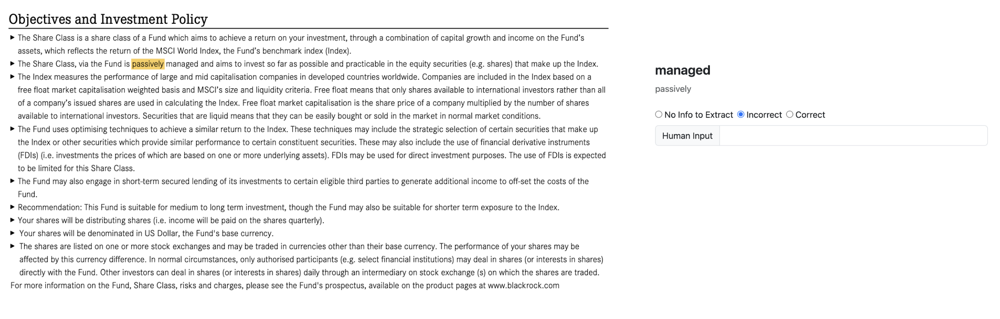

# Leveraging-QA-for-Domain-Agnostic-IE

**TL;DR** -> This repository contains the PDFs and the produced datasets used for the paper "Leveraging Question Answering for Domain-Agnostic Information Extraction".

Read this **README** for a better understanding of the dataset files.

## Introduction

In the paper "Leveraging Question Answering for Domain-Agnostic Information Extraction" we present an approach for extracting information from technical documents on different domains, with minimal effort. It leverages on generic models for Question Answering and on questions formulated with target properties in mind. These are made to specific sections where the answer, then used as the value for the property, should reside. We further describe how this approach was applied to documents of two very different domains: toxicology and finance.

In both cases, an evaluation was perform by domain experts using a web application where the user could upload the suported PDFs and after the process run, it provided the information extracted though a visual crop of the PDF used and an evaluation mechanism in order to obtain the evaluator's feedback. The image bellow demonstrates the elemtnes that were presented to the evaluators, the cropt section of the document, i.e., the text relevant to the key property, the information extracted for that property, and a mechanism to evaluate the information extracted.

 
## Datasets per Use Case

Although the approach used for both domains is the same, slight differences were made in the evaluation, mainly in the creation of the datasets. So for each use case the dataset will be explain in the following sections.

### Toxicological Use Case

In this use case an initial evaluation was performed 

All the PDFs used by the evaluator are public. The Scientific Committee on Consumer Safety (SCCS) opinions can be found in [here](https://health.ec.europa.eu/scientific-committees/scientific-committee-consumer-safety-sccs/sccs-opinions_en) and Australian Insustrial Chemicals Introduction Scheme (AICIS) reports can be found [here](https://services.industrialchemicals.gov.au/search-assessments/).

#### Evaluation using the dataset

##### Results Obtained 

|  | AICIS| SCCS | **All** |
| :---------------: | :---------------: | :---------------: | :---------------: |
| Precision| 0.70| 0.76 | **0.74** |  
| Recall| 0.61 | 0.82 | **0.72**| 
| Accuracy | 0.72 | 0.68 | **0.75** | 
| F-Score| 0.66 | 0.79 | **0.73** | 

### Finance Use Case

The dataset has the following header:

<!-- 
| KIID Type | Document | Section | Variable | Info Extracted | Input Type | Input User |
| --------------- | --------------- | --------------- | --------------- | --------------- | --------------- | --------------- | 
 --> 

1. **KIID Type**: the compaty that produced the PDF
1. **Document**: filename of the PDF
1. **Section**: the name of the section of the paper that was identified as the section related to the information desired to extract
1. **Variable**: the information that we desire to obtain information about
1. **Info Extracted**: the information extracted about the variable
1. **Input Type**: There are two types of inputs, Likert or Input.
1. **Input User**: When in Input Type is Likert, it means that the input is a scale from 1 to 2. When the Input Type is Input then the Input User is a user inserted text.

#### Evaluation using the dataset

##### Results Obtained 

|  | iShares | XTrackers| Amundi | Vanguard | **All** |
| :---------------: | :---------------: | :---------------: | :---------------: | :---------------: | :---------------: | 
| Precision| 0.98| 0.98 | 0.95 | 0.80| **0.95** |  
| Recall| 0.95 | 0.83 | 0.62 | 0.80 | **0.86**| 
| Accuracy | 0.93 | 0.81 | 0.60| 0.67 | **0.82** | 
| F-Score| 0.96 | 0.90 | 0.75 | 0.80 | **0.90** | 